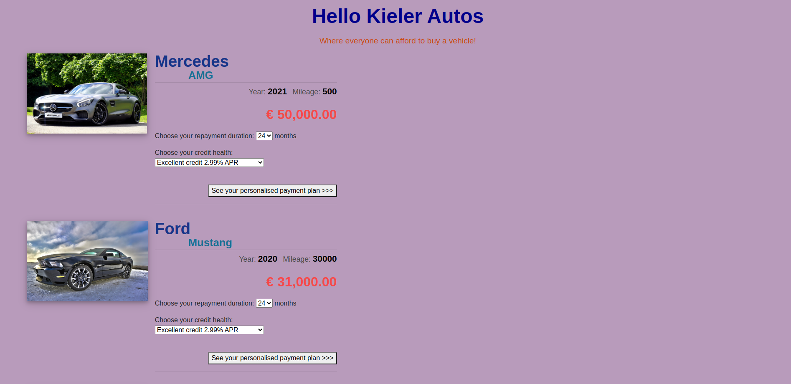
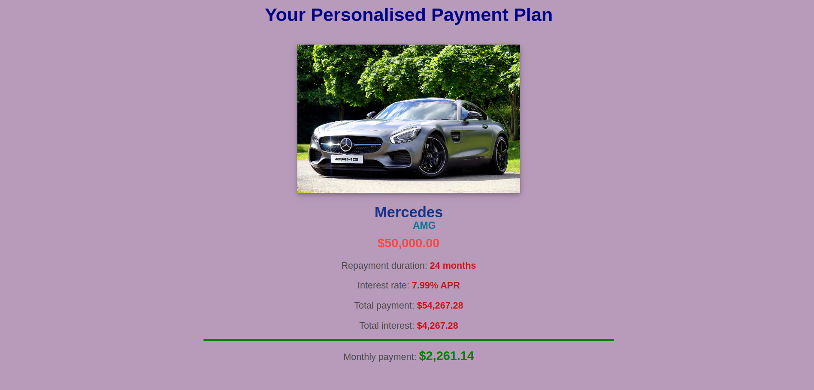

# Hello Kieler Autos

This is a simple PHP-based website named "Hello Kieler Autos." It displays a list of vehicles and allows users to view a personalized payment plan based on their selected repayment duration and credit health.

## Getting Started

To run the website locally, you need a web server with PHP support. You can use XAMPP, WAMP, or any other local server environment. Follow these steps:

1. Clone this repository or download the ZIP file and extract it.
2. Move the project files to the web server's root directory (e.g., "htdocs" in XAMPP).
3. Start your local web server.
4. Open your web browser and navigate to the project's URL (e.g., http://localhost/hello-kieler-autos/).

## Features

- Displays a list of vehicles with their details (make, model, year, mileage, and price).
- Allows users to select a vehicle and calculate a personalized payment plan.
- Payment plan calculation is based on the chosen repayment duration and credit health.
- Responsive design, suitable for various devices.

## Technologies Used

- HTML5
- CSS3 (Bootstrap 4)
- PHP

## Screenshots

## Contributions

Contributions are welcome! If you find any bugs or want to suggest improvements, please open an issue or submit a pull request.

## License

This project is licensed under the [MIT License](LICENSE).
